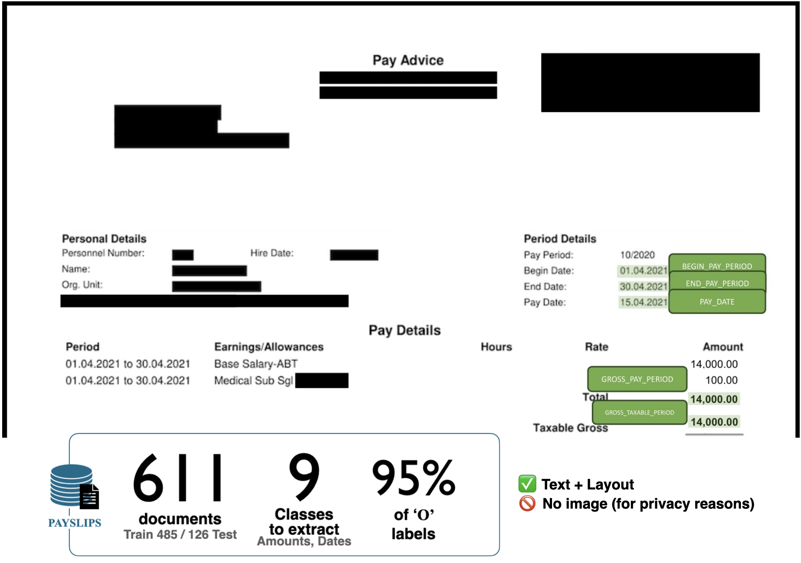

# Payslips Dataset
[](https://opensource.org/licenses/MIT)



## Description


This repository contains the Payslips dataset, which accompanies the paper [Training LayoutLM from Scratch for Efficient Named-Entity Recognition in the Insurance Domain](https://aclanthology.org/2025.finnlp-1.9/) published in **COLING 2025 Workshop FinNLP**. 

### Context
The Payslips dataset consists of payment slips (text and layout, but no image) used in insurance for information verification.
Concretely, an insurer may request a payslip from an applicant to verify that the income stated in the application matches the amount of the premium or the amount of the insurance coverage.

### Content
Payslips includes **611 annotated pages** (485 train and 126 test) with **9 entity types** to extract.
It is intended for use in Document Understanding tasks, particularly Named-Entity Recognition (NER) in the insurance domain.

## Usage

To use the dataset, either clone this repository or use its Hugging Face repository link: 
[https://huggingface.co/datasets/buthaya/payslips](https://huggingface.co/datasets/buthaya/payslips)


## Contact
For help or issues using Payslips, please email [Benno Uthayasooriyar](https://github.com/buthaya) or submit a GitHub issue.

## License
This dataset is released under the MIT License. See [LICENSE](LICENSE) for details.

The license allows the commercial use, modification, distribution, and private use of the dataset, provided that the original copyright notice and this permission notice are included in all copies or substantial portions of the dataset.

The license does not provide any warranty, and the dataset is provided "as is".

The copyright notice and the permission notice shall be included in all copies or substantial portions of the dataset.

## Citation
If you use this dataset in your research, please cite the following paper:
```
@inproceedings{uthayasooriyar-etal-2025-training,
    title = "Training {L}ayout{LM} from Scratch for Efficient Named-Entity Recognition in the Insurance Domain",
    author = "Uthayasooriyar, Benno  and
      Ly, Antoine  and
      Vermet, Franck  and
      Corro, Caio",
    editor = "Chen, Chung-Chi  and
      Moreno-Sandoval, Antonio  and
      Huang, Jimin  and
      Xie, Qianqian  and
      Ananiadou, Sophia  and
      Chen, Hsin-Hsi",
    booktitle = "Proceedings of the Joint Workshop of the 9th Financial Technology and Natural Language Processing (FinNLP), the 6th Financial Narrative Processing (FNP), and the 1st Workshop on Large Language Models for Finance and Legal (LLMFinLegal)",
    month = jan,
    year = "2025",
    address = "Abu Dhabi, UAE",
    publisher = "Association for Computational Linguistics",
    url = "https://aclanthology.org/2025.finnlp-1.9/",
    pages = "101--110",
    abstract = "Generic pre-trained neural networks may struggle to produce good results in specialized domains like finance and insurance. This is due to a domain mismatch between training data and downstream tasks, as in-domain data are often scarce due to privacy constraints. In this work, we compare different pre-training strategies for LayoutLM. We show that using domain-relevant documents improves results on a named-entity recognition (NER) problem using a novel dataset of anonymized insurance-related financial documents called PAYSLIPS. Moreover, we show that we can achieve competitive results using a smaller and faster model."
}
```

## Acknowledgements

This dataset was created as part of the research for the paper "Training LayoutLM from Scratch for Efficient Named-Entity Recognition in the Insurance Domain" by Benno Uthayasooriyar, Antoine Ly, Franck Vermet, and Caio Corro.
We would like to thank the contributors to the dataset collection, anonymization, and annotation efforts : data scientists from SCOR's AI team, and underwriters with expert domain knowledge in insurance.
